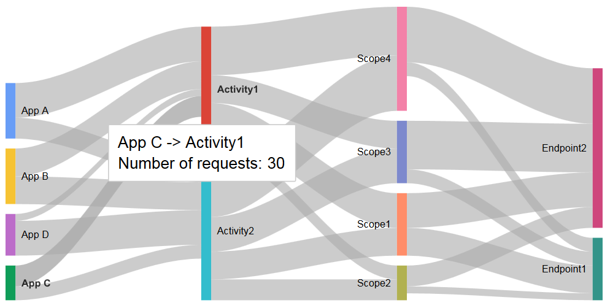

# sankey-panel
Sankey Diagram panel for Grafana



## Acknowledgements
This plugin development is inspired by [Grafana pie chart](https://github.com/grafana/piechart-panel). I have used this code as a base-line to develop this plugin

The Sankey diagram has been created using the [Google Chart](https://developers.google.com/chart/interactive/docs/gallery/sankey)

## Info
In this plugin, the Sankey daigram panel has been used to visualize the distribution between 2 keys. 
Important - This panel is dependent on the google chart and requires loader.js which needs to be included in the Grafana index.html file
```
<script type="text/javascript" src="https://www.gstatic.com/charts/loader.js"></script>
```

The query in the metrics should be grouped by the 2 keywords between which the distribution needs to be visualized as shown below. 


## Installation method

It is also possible to clone this repo directly into your plugins directory.

Afterwards restart grafana-server and the plugin should be automatically detected and used.

```
git clone https://github.com/kumaravel29/sankey-panel.git
sudo service grafana-server restart
```
#### Note: 
From v6.7, automatic loading of unsigned plugin is disabled. To load unsigned plugin, use the additional setting of [allow_loading_unsigned_plugins](https://grafana.com/docs/grafana/latest/administration/configuration/#allow_loading_unsigned_plugins) in the plugins section of grafana.ini
```ini
[plugins]
;enable_alpha = false
;app_tls_skip_verify_insecure = false
# Enter a comma-separated list of plugin identifiers to identify plugins to load even if they are unsigned. Plugins with modified signatures are never loaded.
allow_loading_unsigned_plugins = grafana-sankey-panel
# Enable or disable installing plugins directly from within Grafana.
;plugin_admin_enabled = false
;plugin_admin_external_manage_enabled = false
;plugin_catalog_url = https://grafana.com/grafana/plugins/
```
For Grafana in docker, this can be achieved by setting the environment variable also.
```env
GF_PLUGINS_ALLOW_LOADING_UNSIGNED_PLUGINS=grafana-sankey-panel
```

## Clone into a directory of your choice

If the plugin is cloned to a directory that is not the default plugins directory then you need to edit your grafana.ini config file (Default location is at /etc/grafana/grafana.ini) and add this:

```ini
[plugin.sankey]
path = /home/your/clone/dir/sankey-panel
```

Note that if you clone it into the grafana plugins directory you do not need to add the above config option. That is only
if you want to place the plugin in a directory outside the standard plugins directory. Be aware that grafana-server
needs read access to the directory.

# Changelog

1.0.0 - Initial plugin code for Grafana 4.6

2.0.0 - Changes for support Grafana 5.x

3.0.0 - Changes for support Grafana 6.x
